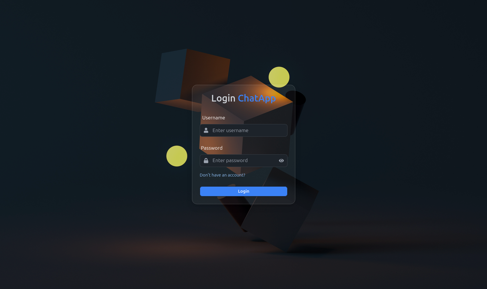
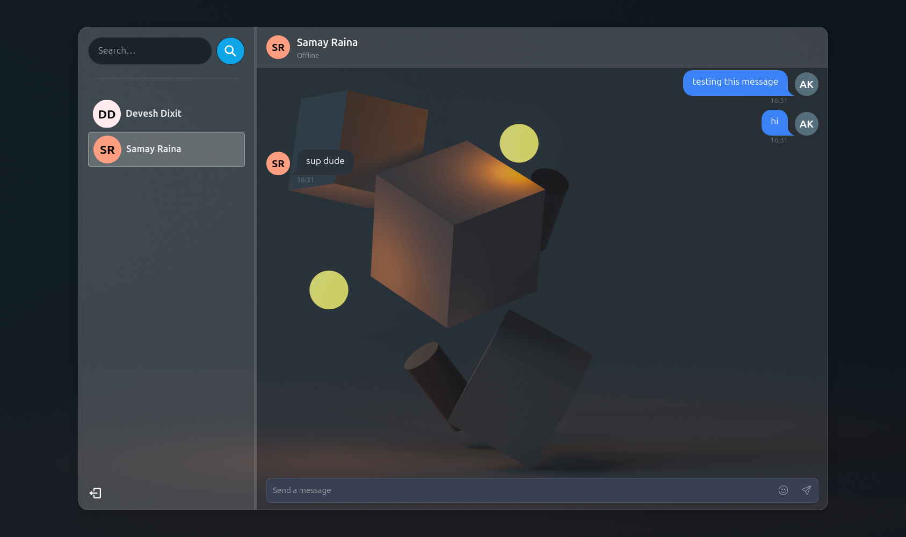

# React + Express Socket.io Chat App 🚀💬

A real-time chat application built with React (frontend) and Express.js (backend) using Socket.io for live communication.




## Features ✨

- User login/signup with unique username and password authentication 🔐
- Real-time chat with multiple users 👥
- Emojis and reaction support for messages 😂👍
- Media support in chat (send images and videos) 🖼️📹
- Customizable profile icons 👤
- Create and manage groups (add/remove members, admin roles, group icons)
- State management with Zustand ⚡
- UI styled with elegant glassmorphism effect 🪟
- Message caching to minimize redundant API calls 📦
- MongoDB used as the database 🍃

## Tech Stack 🛠️

**Frontend:** React, Zustand, Socket.io-client, emoji-picker-react, framer-motion, idb, react-hot-toast, react-icons, react-router-dom  
**Backend:** Express.js, Socket.io, MongoDB, JWT authentication, bcryptjs, cloudinary, cookie-parser, dotenv, jsonwebtoken, mongoose

## Getting Started 🏁

### Prerequisites 📋

- Node.js installed
- MongoDB database ready

### Installation 💻

1. Clone the repository

2. Install dependencies in both frontend and backend folders:

```bash
cd frontend
npm install

cd ../backend
npm install
```

3. Create a `.env` file in the backend folder with the following variables:

```env
PORT=5000
MONGO_DB_URI=your_mongodb_connection_string
JWT_SECRET=your_jwt_secret
NODE_ENV=development
CLOUDINARY_CLOUD_NAME=your_cloudinary_cloud_name
CLOUDINARY_API_KEY=your_cloudinary_api_key
CLOUDINARY_API_SECRET=your_cloudinary_api_secret
```

### Running Locally ▶️

1. Start the backend server (runs on port 5000):

```bash
cd backend
npm start
```

2. Start the frontend (runs on port 3000):

```bash
cd frontend
npm start
```

## Usage 🎉

- Register or login with your unique username and password
- Start chatting with any person signed up on this platform in real-time
- Express yourself with emojis and reactions
- Share images and videos directly in chats
- Customize your profile icon
- Create and manage chat groups with various functionalities
- Messages are cached locally to reduce API calls and improve performance
- Enjoy a smooth and modern glassmorphism UI 🪟

Feel free to contribute or report issues.  
**Happy chatting! 🚀**