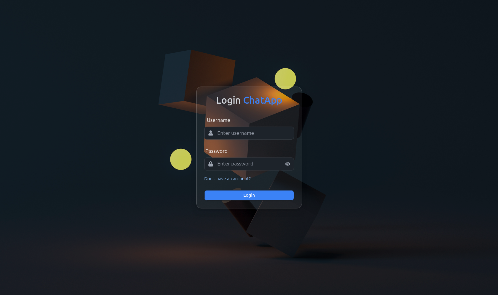
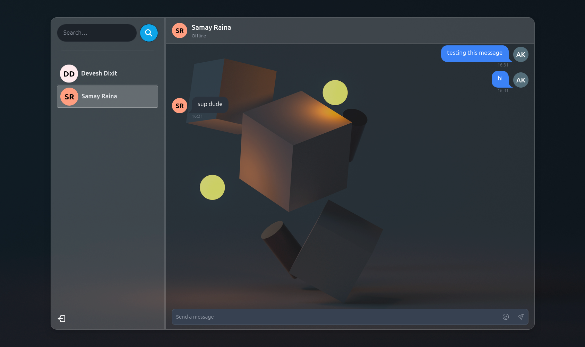

# React + Express Socket.io Chat App 🚀💬

A real-time chat application built with React (frontend) and Express.js (backend) using Socket.io for live communication.




## Features ✨

- User login/signup with unique username and password authentication 🔐
- Real-time chat with multiple users 👥
- Emojis and reaction support for messages 😂👍
- Read Receipts (Sent / Read ticks) & Unread Message Indicators ✔️✔️
- Media support in chat (Drag & Drop images and videos with progress bars) 🖼️📹
- Server-Side Encryption at Rest (AES-256) to protect database message history 🛡️
- Rate Limiting and Abuse Protection against spam attacks 🚦
- WhatsApp-style Stale-While-Revalidate caching for instant offline loads ⚡
- Customizable profile icons and Privacy Controls (Public/Private profiles) 👤
- Create and manage groups (add/remove members, admin roles, group icons)
- State management with Zustand 🧠
- Modern and responsive UI built with **Mantine UI** 🎨
- Dark/Light mode toggle and customizable primary themes 🌗
- Resizable split-pane sidebar for a tailored chat experience 📏
- MongoDB used as the database 🍃

## Tech Stack 🛠️

**Frontend:** React, Mantine UI (@mantine/core, @mantine/notifications), Zustand, Socket.io-client, emoji-picker-react, idb, react-icons, react-router-dom
**Backend:** Express.js, Socket.io, MongoDB, JWT authentication, bcryptjs, cloudinary, cookie-parser, dotenv, jsonwebtoken, mongoose, express-rate-limit, helmet

## Getting Started 🏁

### Prerequisites 📋

- Node.js installed
- MongoDB database ready

### Installation 💻

1. Clone the repository

2. Install dependencies in both frontend and backend folders:

```bash
cd frontend
npm install

cd ../backend
npm install
```

3. Create a `.env` file in the backend folder with the following variables:

```env
PORT=5000
MONGO_DB_URI=your_mongodb_connection_string
JWT_SECRET=your_jwt_secret
NODE_ENV=development
CLOUDINARY_CLOUD_NAME=your_cloudinary_cloud_name
CLOUDINARY_API_KEY=your_cloudinary_api_key
CLOUDINARY_API_SECRET=your_cloudinary_api_secret
ENCRYPTION_KEY=your_super_secret_32_character_key
```

### Running Locally ▶️

1. Start the backend server (runs on port 5000):

```bash
cd backend
npm start
```

2. Start the frontend (runs on port 3000):

```bash
cd frontend
npm start
```

## Usage 🎉

- Register or login with your unique username and password
- Start chatting with any person signed up on this platform in real-time
- Express yourself with emojis and reactions
- See when your messages are delivered and read with double-tick receipts ✔️✔️
- Drag and drop images and videos directly into chats with live upload progress 📤
- Toggle your profile privacy to hide from public searches
- Create and manage chat groups with various functionalities
- Messages load instantly using advanced offline caching, syncing automatically in the background
- Personalize your UI experience with Light/Dark mode and custom theme colors 🎨
- All messages are AES-256 encrypted at rest inside the database for maximum privacy 🔐

Feel free to contribute or report issues.  
**Happy chatting! 🚀**